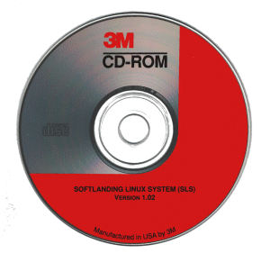

SLS 1.02
========

This was the distribution to have in 1993, it was my first Linux
distribution. To this day I haven't reinstalled the system that this was
installed on. The machine has been upgraded, hard disks, motherboard,
tape drives and so on. At some point during the nineties I upgraded the
OS to use Debian Linux and since then it has been upgraded normally. But
... there are still a few signs of the original SLS 1.02 install.

To recreate the CD-ROM ISO file you can use the "jigdo-file" tool ...

`$ jigdo-file make-image --jigdo=ISO/SLS-1.02.iso.jigdo *`

But this probably isn't very useful as the CD-ROM is not bootable.
The CD-ROM contains all the binaries and source uncompressed on the CD-ROM.
There are floppy disk images for both 3½ and and 5¼ inch floppy drives.

Installed!
==========

On the other hand a nice plain install of SLS 1.02 may be useful.
This command should quickly reconstruct it for you.

`$ jigdo-file make-image --jigdo=ISO/sls102_i386.qcow2.jigdo *`

Use the `qemu-system-i386` command below to run it.

How to Install
==============

    CDROM=/somwhere/on/your/disk
    FLOPPY=`pwd`/floppy.img
    DISK=`pwd`/sls-img.qcow2
    FATDRIVE=`pwd`/slsfat

    [ ! -e "$DISK" ] &&
        qemu-img create -f qcow2 "$DISK" 500M

    mkdir "$FATDRIVE"
    cp "$CDROM"/install/a1.3 "$FLOPPY"
    cp -a "$CDROM"/install "$FATDRIVE"/.

    qemu-system-i386 \
        -M isapc \
        -m 16M \
        -hda "$DISK" \
        -no-reboot \
        -net nic -net user,hostfwd=tcp:127.0.0.1:2023-:23 \
        -vga std -monitor vc \
        -fda "$FLOPPY" \
        -rtc base="date +1996-%m-%dT%T" \
        -boot once=a \
        -hdb fat:"$FATDRIVE" \

    A disk of 500M is sufficient (or even huge!) and if you go above it you may
    run into problems with "lilo" and the BIOS.

    The "rtc base" is needed because SLS1.02 has a Y2K bug, 1996 is the last leap
    year before this triggers. The "isapc" machine type is required to make the
    network adaptor one that works with SLS1.02. Powerdown doesn't work correctly
    so I use the "--no-reboot" trick. I've left the monitor console on Ctrl-Atl-2
    as I won't need to swap floppies.

    The install is very manual, you'll have to create the partition table directly
    with "fdisk" and format it with "mke2fs". Don't worry about the Minux warning,
    ext2 doesn't have the limitation. Don't bother with a swap partition, it can
    only be 16Mb anyway and this version of Linux doesn't use a /boot partition.

    The /dev/hdb1 partition will contain the files required for a mounted hard
    disk install. Mount it onto "/mnt" before running the installer command.

    You can overwrite the boot floopy (don't swap the floppy) when it comes to
    that point in the install.

    You will have to manually dismount all the partitions before doing a "quit"
    command on the monitor console to turn off the VM.

    The boot and FAT device are not needed once the install has completed.

        -boot once=a \
        -hdb fat:"$FATDRIVE" \

  ----------------------------------------------------------------------------

    The Y2K bug is in "usr/src/time/clock.c", once it's fixed, compiled and
    installed the RTC line can be replaced:

        -rtc base=localtime \

    diff --git a/usr/src/time/clock.c b/usr/src/time/clock.c
    index 9694bab..fbb8852 100644
    --- a/usr/src/time/clock.c
    +++ b/usr/src/time/clock.c
    @@ -113,6 +113,7 @@ main (int argc, char **argv, char **envp) {
           tm.tm_mday = cmos_read(fd, 7);
           tm.tm_mon = cmos_read(fd, 8);
           tm.tm_year = cmos_read(fd, 9);
    +      if (tm.tm_year < 70) tm.tm_year += 100;
         } while (tm.tm_min != cmos_read(fd, 2));
         tm.tm_mon--;
       }

  ----------------------------------------------------------------------------
